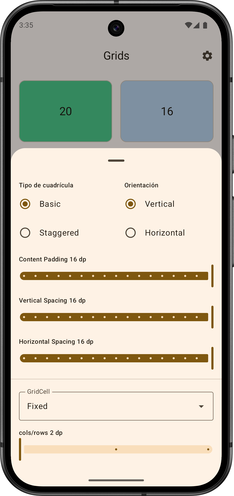

# 🧩 Uso de Grids en Android

Este proyecto contiene el código final del tutorial **[Grids en Android](https://www.develou.com/grids-en-android/)** publicado en el blog de Develou.

📚 Aprende a:
- Crear cuadriculas con `LazyVerticalColumn` y `LazyHorizontalGrid`
- Crear cuadriculas escalonadas con `LazyVerticalStaggeredGrid` y `LazyHorizontalStaggeredGrid`
- Aplicar márgenes y espaciado personalizado
- Añadir animaciones a las celdas

---

## 📸 Ejemplos

  
  
  

